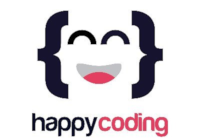

# cac-22809-desafio_02

Este repositorio se abre para cumplir con el segundo desafío planteado en la comisión #22809 del curso React del programa Codo a Codo 2022 segundo cuatrimestre.

## Condiciones

Estas condiciones fueron planteadas por el profesor del curso.

1. Se trabajará en una sola rama.
2. Cada integrante del equipo deberá agregar su línea de presente.
3. Dentro de lo posible manejarse con comandos de terminal para practicar.

## Cómo colaborar

> **IMPORTANTE** 
>
> Dado que tenemos que trabajar con una sola rama, avisen por el grupo de Whatsapp cuando van a comenzar para evitar dentro de lo posible solaparse con otros colaboradores.

1. Informar al grupo de Whatsapp el correo electrónico asociado a la cuenta de Github para poder agregarlo como colaborador del proyecto.
2. Si aun no clonaron el proyecto clonar el proyecto en la carpeta de su preferencia con: `git clone git@github.com:cesaremorel/cac-22809-desafio_02.git` o `git clone https://github.com/cesaremorel/cac-22809-desafio_02.git`. El primer enlace sólo funcionará si ya subieron sus llaves ssh a GitHub ([Ver mas info](https://github.com/settings/keys)).
3. Ir a la carpeta del proyecto **cac-22809-desafio_02**.
4. Dentro de la carpeta del proyecto traer los últimos cambios con `git pull`.
5. Modificar el archivo `presentismo.txt` agregando una línea con su nombre completo.
6. Agregar el archivo modificado al area de preparación de git con `git add presentismo.txt`.
7. Confirmar los cambios realizados con `git commit -m MENSAJE`. Reemplacen _MENSAJE_ con su mensaje de commit, por ejemplo "Agrega presentismo: Cesar Morel".
8. Subir los cambios al repositorio remoto con `git push`.

